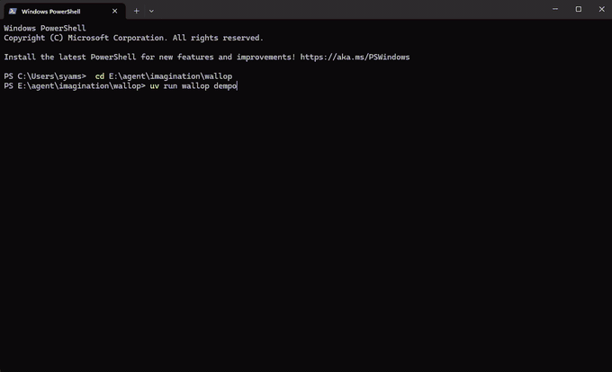

# wallop

[](https://github.com/siam-hossain9/wallop/actions/workflows/ci.yml)


**HTTP load testing you can feel.** Every request is a particle. Watch them fly across your terminal and slam into your server — successes spark green, 404s ricochet, 500s explode, timeouts dissolve into smoke. Latency is literally flight time.

> Think *Logstalgia meets oha*: a real load generator with real stats (RPS, p50/p95/p99, status codes), rendered as a live physics scene instead of yet another line chart.

<!-- HERO DEMO: record with `vhs demo/wallop.tape` or any screen recorder.
     Capture `wallop demo` for ~40s in a 110x30 Windows Terminal / iTerm2 window:
     it shows the full incident arc — healthy green impacts, latency creep
     (particles stalling mid-air), an error storm (red explosions + screen
     shake + embers on the ground), meltdown, recovery.
     Then uncomment the line below:

-->

> 🎬 **See it live in 10 seconds:** `uv tool install wallop && wallop demo`

## Why

Load tests produce the most dramatic data in software — a server being hammered, degrading, recovering — and we render it as the world's most boring line charts. You stare at a p99 number and feel nothing.

`wallop` makes load visceral while staying a real tool:

- **Latency is flight time.** Fast servers feel like a laser stream. Slow servers make particles visibly hang mid-air, piling up in front of the wall.
- **Failures are physical.** 4xx ricochet off in orange arcs. 5xx detonate with debris, screen shake, and embers that smolder on the ground. Timeouts never reach the wall — they fade into grey smoke.
- **The wall is your server's mood ring.** It glows green when healthy and burns red as the error rate climbs.
- **The numbers are still there.** Live RPS, p50/p95/p99, per-class status counts, error rate, in-flight count, and an RPS sparkline — plus a vegeta-style summary when you're done.

It runs over SSH, in any modern terminal, with zero OpenGL, zero browser, one dependency.

## Quickstart (60 seconds)

```sh
# with uv (recommended)
uv tool install wallop        # or: pipx install wallop

# the instant wow — spins up a built-in chaos server and hammers it
# through a scripted incident: healthy → latency creep → error storm
# → meltdown → recovery
wallop demo

# hammer your own service
wallop http://localhost:8080/api/health -c 100 -d 30s
```

Running from a clone instead:

```sh
git clone https://github.com/siam-hossain9/wallop && cd wallop
uv run wallop demo
```

Press `q` or `Ctrl+C` to stop. You get a clean summary either way:

```
  ─────────────────────────────────────────────
  wallop summary — http://localhost:8080/api/health
  ─────────────────────────────────────────────
  duration   30.0s
  requests   45,231  (1,507.7 req/s)
  latency    p50 12ms   p90 33ms   p95 48ms   p99 130ms
             min 4ms    max 1.21s
  status     2xx 44,903 · 4xx 210 · 5xx 118
  data read  12.4 MB
```

## Usage

```
wallop URL [options]          hammer a URL
wallop demo                   built-in chaos server + load run (the GIF maker)
wallop serve [--port 8089]    run only the chaos server, point anything at it
```

| Option | Default | Meaning |
| --- | --- | --- |
| `-c, --concurrency` | 50 | concurrent workers |
| `-d, --duration` | until `q` | e.g. `30s`, `2m`, `500ms` |
| `-n, --requests` | — | stop after N total requests |
| `-r, --rate` | unlimited | cap request rate (req/s) |
| `-m, --method` | GET | HTTP method |
| `-H, --header` | — | `'Name: value'`, repeatable |
| `-b, --body` | — | request body, or `@file` |
| `-t, --timeout` | 10 | per-request timeout (seconds) |
| `-k, --insecure` | off | skip TLS verification |
| `--fps` | 30 | render frame rate |

### Reading the scene

| You see | It means |
| --- | --- |
| Yellow streaks crossing fast | requests completing quickly |
| Particles hovering near the wall | responses are slow (they stall at ~96% until the response lands) |
| Green sparks on the wall | 2xx |
| Orange particles bouncing back under gravity | 4xx |
| Red explosions, screen shake, embers on the ground | 5xx |
| Grey smoke rising mid-field | timeouts / connection errors |
| Wall turning from green to red | recent error rate climbing |

## Architecture

```
            ┌────────────────────────────────────────────────┐
            │                  asyncio loop                  │
            │                                                │
  workers   │  engine.py ──on_start/on_complete──▶ app.py    │
  (aiohttp) │  LoadEngine                          │    │    │
            │   · N workers                        ▼    ▼    │
            │   · token-bucket rate          stats.py  physics.py
            │   · timeout/error taxonomy     RPS, p50  World: particles,
            │                                p95, p99  debris, gravity,
            │                                EMA       embers, shake
            │                                  │         │
            │                                  ▼         ▼
            │                              renderer.py            │
            │                              half-block (▀▄) pixel  │
            │                              framebuffer → one      │
            │                              ANSI write per frame   │
            └────────────────────────────────────────────────┘
```

- One process, one event loop. Engine callbacks mutate the world directly — no queues, no threads.
- The renderer doubles vertical resolution with half-block characters and 24-bit color, composing each frame into a single write.
- Physics is decoupled from frame rate (dt-based), so it looks right at any `--fps` and any terminal size, and survives window resizes mid-run.
- ~1,300 lines of Python, one runtime dependency (`aiohttp`).

## Honest limits

- Python load generation comfortably drives a few thousand req/s per core. For saturating a 10 Gbps NIC, use `wrk`/`vegeta` — for *watching and understanding* realistic load, use wallop.
- At high RPS, impact effects are sampled (debris budget) so rendering never lies about your machine's ability to generate load.

## Roadmap

- `--replay` mode: pipe an access log (or `tail -f`) in and watch *production* traffic instead of generated load
- Per-endpoint lanes when hammering multiple URLs
- HTTP/2 + WebSocket targets
- Latency histogram wall: impact height encodes response time
- A `--record` flag that writes asciinema casts for sharing

## Development

```sh
uv sync          # install with dev deps
uv run pytest    # 40 tests covering stats, physics, renderer, engine, CLI
```

Contributions welcome — see [CONTRIBUTING.md](CONTRIBUTING.md).

## License

[MIT](LICENSE)
